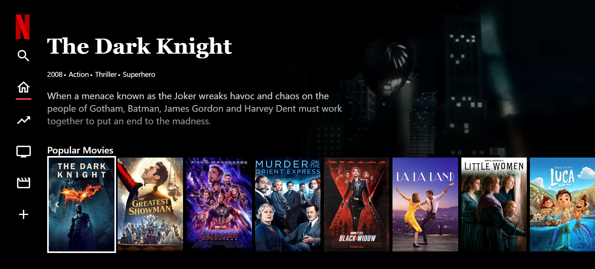

# Netflix Dupe

A Netflix clone built with Vite, Vue.js, and Tailwind CSS.

## Features

- **Responsive Design**: Built with Tailwind CSS to ensure a responsive and modern UI.
- **Fast Development**: Utilizes Vite for a fast and efficient development experience.
- **Component-Based Architecture**: Developed using Vue.js for a modular and maintainable codebase.
- **State Management**: Manage application state efficiently with Vuex.
- **Routing**: Implemented with Vue Router for seamless navigation.
- **API Integration**: Fetch and display data from external APIs.

## Prerequisites

- Node.js (version 16 or higher)
- npm (version 7 or higher)

## Installation

1. Clone the repository:
   ```sh
   git clone https://github.com/CodeCourtAce/NetflixDupe.git
   cd netflix-clone
   npm install
   npm run build
   npm run dev
## 

## Future Development

- **User Authentication**: Implement user authentication using Firebase or another authentication service.
- **User Profiles**: Allow users to create and manage their profiles.
- **Watchlist**: Enable users to add movies and shows to their watchlist.
- **Search Functionality**: Add a search bar to allow users to search for movies and shows.
- **Recommendations**: Implement a recommendation system based on user preferences and watch history.
- **Improved UI/UX**: Continuously improve the user interface and user experience based on feedback.
- **Testing**: Add unit and integration tests to ensure the reliability of the application.

## License

This project is licensed under the MIT License.

## Acknowledgements

- [Vue.js](https://vuejs.org/)
- [Vite](https://vitejs.dev/)
- [Tailwind CSS](https://tailwindcss.com/)
- [Render](https://render.com/)

## Credit 

CodeCourtAce & John Paul D'Aconti

## Note

We used stock footage due to copyright 😊

## Images of Site 



## Link to Deployed Site

https://ggnetdupe.netlify.app/